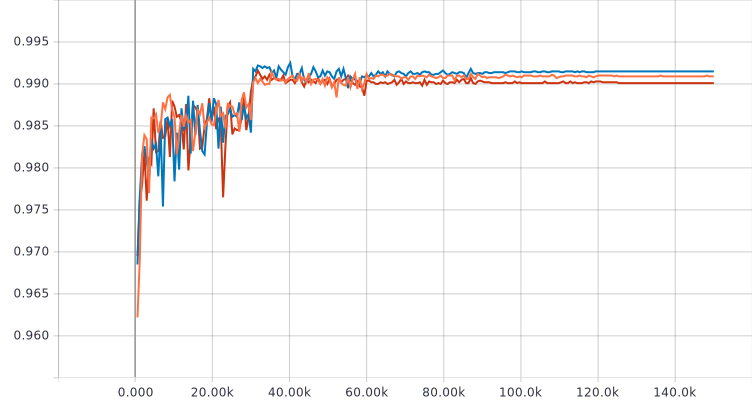
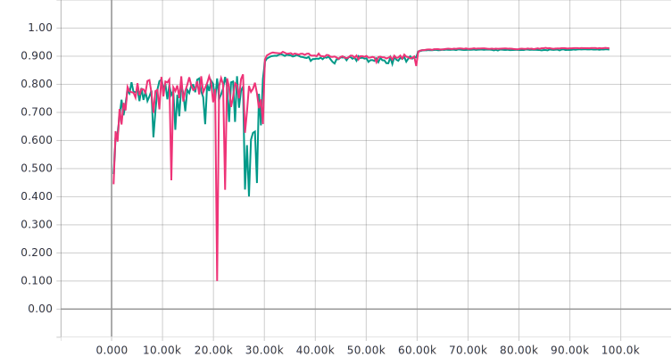

## SNIP: Single-shot network pruning based on connection sensitivity

This is an _unofficial_ PyTorch implementation of the paper [SNIP: Single-shot Network Pruning based on Connection Sensitivity](https://arxiv.org/abs/1810.02340) by Namhoon Lee, Thalaiyasingam Ajanthan and Philip H. S. Torr.

## Environment
This has been tested with Python 3.7.1 and PyTorch 1.0.0. The exact environment can be replicated by:

`$ conda env create -f environment.yml`

This would create a conda environment called `snip-env`.

## Usage

```
$ conda activate snip-env
$ python train.py
```

## Results

Three runs with different seeds with LeNet5-Caffe on MNIST (sparsity level of 98%):




Two runs with different seeds with VGG-D on CIFAR-10 (sparsity level of 95%):


